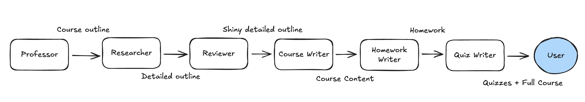

# personal-academy

Institutional forms of learning aren't accessible to everyone, slow, expensive and not flexible.
PersonalAcademy is a platform that allows you to learn at your own pace, in your own time, and on your own schedule.
Courses are created by AI agents that are able to generate content, review and grade your work, and provide feedback.

## How to run:
- `pip install crewai streamlit`
- put your OpenAI API key and model name in the `.env` file in the `personal_academy/` folder

example:

`MODEL=gpt-4o-mini`

`OPENAI_API_KEY=sk-proj-...`
- `streamlit run app.py`

## Agents Involved

### Advisor (not implemented yet)
The advisor will take your input of what you want to learn and your experience to help guide you on what you should learn.
Tasks:
- Take your input and workshop the difficulty and structure of the course based on your experience.

### Professor
The professor will work with the advisor to create an outline of a personalized course for you and manage the creation of the course through other agents.
Tasks:
- Create an outline of a personalized course for you.
- Manage the creation of the course.

### Researcher
The researcher will work with the professor to research the content of the personalized course for you.
Tasks:
- Research the content of the personalized course.

### Course Writer
The course writer will work with the researcher to write the personalized course for you.
Tasks:
- Write the personalized course for you.

### Course Lecturer
The course lecturer will work with the course writer to lecture the personalized course for you.
Tasks:
- Lecture the personalized course for you.

### Course Homework Creator
The course homework creator will work with the course writer to create homework for the personalized course for you.
Tasks:
- Create homework for the personalized course for you.

### Course Quiz Creator
The course quiz creator will work with the course writer to create quizzes for the personalized course for you.
Tasks:
- Create quizzes for the personalized course for you.

### Teaching Assistant (not implemented yet)
The teaching assistant will work with the professor and student to review the student's work, answer questions and provide feedback.
Tasks:
- Review the student's work.
- Answer questions.
- Provide feedback.

## Student-in-the-loop (not implemented yet)
The student will consume the course and provide feedback to the professor so the course can be improved.